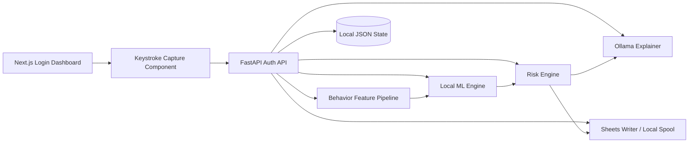

# Module 1 Architecture Diagram

```mermaid
flowchart LR
  UI[Next.js Login Dashboard] --> CAP[Keystroke Capture Component]
  CAP --> API[FastAPI Auth API]
  API --> B[Behavior Feature Pipeline]
  API --> ML[Local ML Engine]
  API --> R[Risk Engine]
  API --> O[Ollama Explainer]
  API --> S[Sheets Writer / Local Spool]
  B --> ML
  ML --> R
  R --> O
  R --> S
  API --> D[(Local JSON State)]
```
